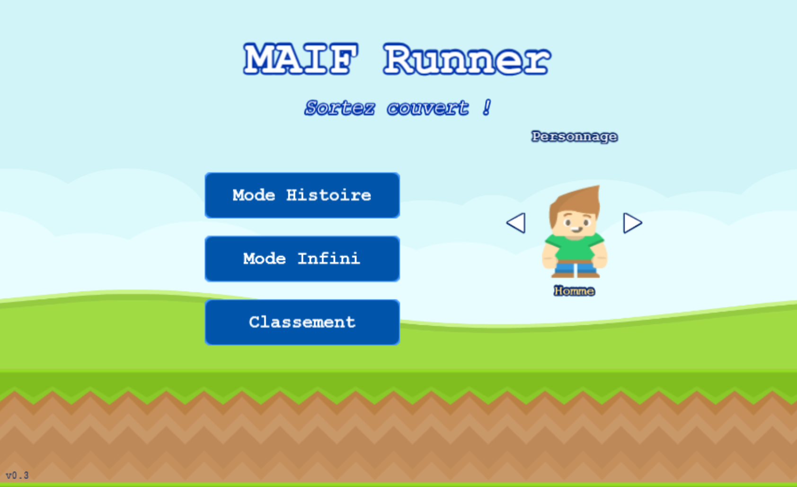
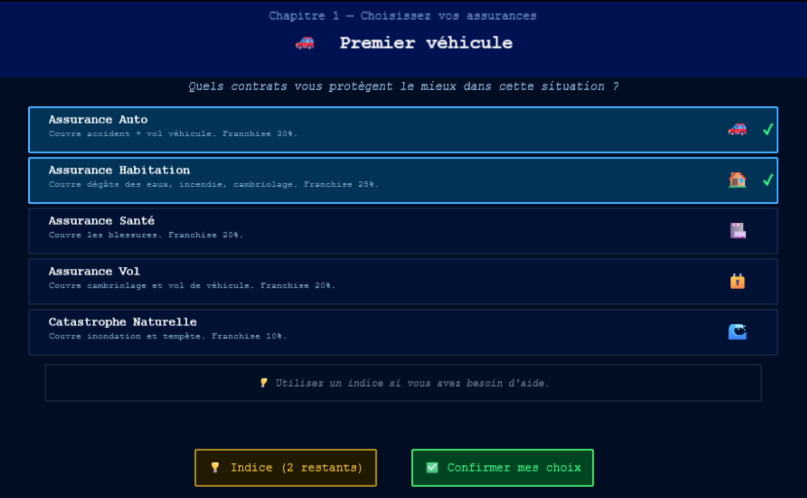
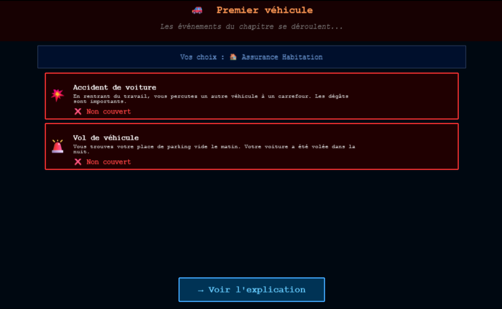
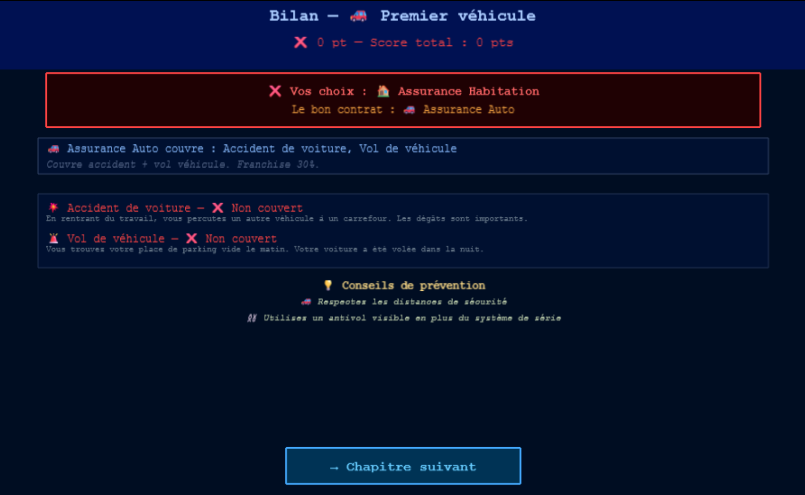
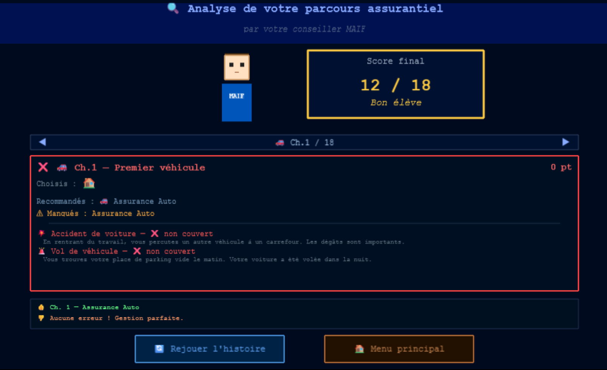
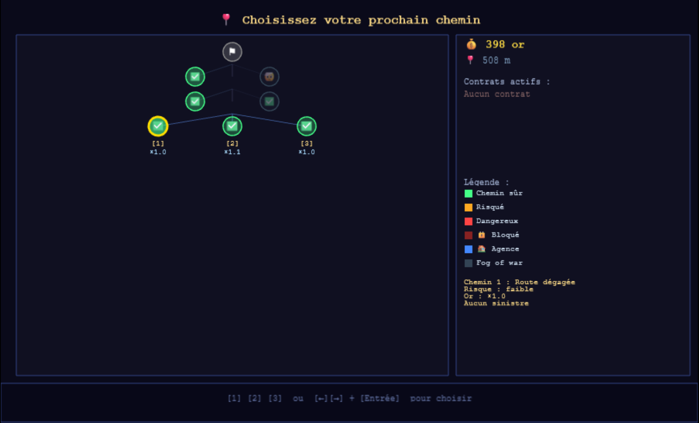
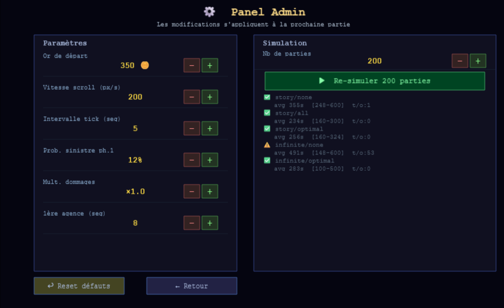

# MAIF Runner — _Sortez Couvert !_

Jeu de runner 2D éducatif sur la gestion des assurances. Deux modes de jeu : un **quiz pédagogique** en 6 chapitres de vie et un **runner infini** en scrolling. Développé avec **Phaser 3 + TypeScript + Vite**.



---

## Modes de jeu

Le jeu propose deux expériences distinctes, accessibles depuis le menu principal :

| Mode                 | Objectif                                                           | Public                    |
| -------------------- | ------------------------------------------------------------------ | ------------------------- |
| 📖 **Mode Histoire** | Quiz pédagogique en 6 chapitres de vie — choisir les bons contrats | Découverte des assurances |
| 🏃 **Mode Infini**   | Runner en scrolling, survivre le plus longtemps possible           | Arcade / challenge        |

---

## 📖 Mode Histoire

Un parcours narratif en **6 chapitres de vie**, guidé par votre conseiller MAIF. À chaque étape, une situation du quotidien vous est présentée et vous devez choisir les contrats d'assurance les plus adaptés.

### Flux complet d'un chapitre

```
ChapitreIntroScene
  ↓  (dialogue terminé ou "Passer →")
ContractSelectionScene
  ↓  (confirmer ses choix)
DisasterRevealScene
  ↓  (voir l'explication)
ChapitreResultScene
  ↓  (→ Chapitre suivant  ou  🔍 Analyse finale)
      …répéter pour les 6 chapitres…
StoryAnalysisScene
```

---

### Les 6 chapitres

| #   | Titre                 | Situation                                                          | Contrats recommandés                    |
| --- | --------------------- | ------------------------------------------------------------------ | --------------------------------------- |
| 1   | 🚗 Premier véhicule   | Vous venez d'obtenir le permis et d'acheter votre première voiture | Auto                                    |
| 2   | 🏠 Nouvel appartement | Emménagement dans votre premier appartement                        | Habitation                              |
| 3   | 🌧️ Hiver difficile    | Tempêtes, inondations et routes verglacées                         | Catastrophe + Auto                      |
| 4   | 💼 Vie active         | Sport, déplacements fréquents, vie trépidante                      | Santé + Auto + Vol                      |
| 5   | 🔥 Été à risque       | Maison vide en vacances, feux de forêt                             | Habitation + Vol                        |
| 6   | 🌊 L'année noire      | La loi des séries : cumul de sinistres graves                      | Auto + Habitation + Catastrophe + Santé |

---

### 1. Introduction du chapitre (ChapitreIntroScene)

Votre conseiller MAIF vous présente la situation via une boîte de dialogue animée. Il adapte son expression (souriant, inquiet, normal, fier) selon le contexte.

- Avancer le dialogue : **Espace**, **Entrée** ou clic
- Passer l'intro : bouton **"Passer →"** en bas à droite

---

### 2. Sélection de contrats — le quiz (ContractSelectionScene)

Choisissez parmi les 5 types de contrats ceux qui protègent le mieux face à la situation décrite.



**Multi-sélection** : vous pouvez cocher plusieurs contrats. Un ✔ vert apparaît sur chaque carte sélectionnée (fond bleuté). Cliquer à nouveau désélectionne.

**Système d'indices** : jusqu'à 2 indices par chapitre.

- Indice 1 : révèle le type de risque principal
- Indice 2 : révèle directement le contrat recommandé
- Chaque indice utilisé **réduit le score maximal** du chapitre

Le bouton **✅ Confirmer mes choix** n'est actif qu'une fois au moins un contrat sélectionné.

---

### 3. Révélation des sinistres (DisasterRevealScene)

Les événements du chapitre se déroulent un par un avec une animation dramatique :

- Flash vert si le sinistre est **couvert** par vos contrats
- Flash rouge + tremblement si le sinistre est **non couvert**



Chaque sinistre affiche son nom, son récit contextualisé, et si votre couverture s'applique.

---

### 4. Bilan pédagogique (ChapitreResultScene)

Explication détaillée après chaque chapitre :

- **Verdict** : ✅ Parfait / 🟡 Partiel / ❌ Raté
- Score gagné pour ce chapitre
- Liste des contrats que vous avez choisis (avec icônes colorées)
- Contrat(s) idéalement recommandé(s) et ce qu'il(s) couvre(nt)
- Tableau de tous les sinistres avec statut couvert/non couvert
- Conseils de prévention spécifiques à la situation



---

### 5. Système de score

Le score s'étend de **0 à 18 points** (3 points max × 6 chapitres).

Pour chaque chapitre :

```
baseScore = max(0, round(correctCount × 3 / totalNeeded) - wrongCount)
scoreEarned = max(0, baseScore - hintsUsed)
```

- Sélectionner tous les bons contrats sans erreur → 3 pts
- Sélectionner certains bons mais aussi de mauvais → malus
- Chaque indice utilisé → −1 pt
- Mauvaise couverture complète → 0 pt

| Score | Verdict             |
| ----- | ------------------- |
| 15–18 | Expert en assurance |
| 10–14 | Assuré averti       |
| 5–9   | Assuré imprudent    |
| 0–4   | À risque            |

---

### 6. Analyse finale (StoryAnalysisScene)

Récapitulatif complet de votre parcours avec votre conseiller MAIF :

- **Score total** et verdict coloré (vert / orange / rouge)
- Expression du conseiller adaptée à votre performance
- Navigation **◀ ▶** (ou flèches clavier) entre les 6 fiches chapitres
- Chaque fiche détaille : contrats choisis (colorés ✓/✗), contrats recommandés, sinistres et couvertures
- Résumé de votre meilleure et pire décision
- Boutons : **🔄 Rejouer** ou **🏠 Menu principal**



---

### Sauvegarde de session

La progression est **automatiquement sauvegardée** dans le `sessionStorage` du navigateur à chaque étape. En cas de fermeture accidentelle ou de refresh :

- Le menu principal affiche un bouton **▶ Continuer Ch.X** (vert)
- La partie reprend exactement là où elle s'était arrêtée
- Démarrer une nouvelle histoire efface la session précédente

---

## 🏃 Mode Infini

Runner en scrolling 2D sans fin. L'objectif est de **survivre le plus longtemps possible** en gérant ses contrats d'assurance face à des risques croissants.

### Boucle principale

```
MenuScene
  ↓
PlatformerScene ←────────────────────────────┐
  ↓  (fork atteint)                          │
MapScene → (chemin choisi) ──────────────────┘
  ↓  (agence MAIF atteinte)
AgencyScene (overlay, jeu en pause)
  ↓  (or = 0)
GameOverScene → LeaderboardScene
```

---

### Phase Platformer

Le personnage court automatiquement de gauche à droite. Il faut éviter les obstacles et collecter les pièces.

| Action  | Touche      |
| ------- | ----------- |
| Sauter  | ↑ ou Espace |
| Glisser | ↓           |
| Pause   | Échap       |

**Pièces** :

- Pièce au sol : **3 🪙**
- Pièce en hauteur (nécessite de sauter) : **8 🪙**

**Obstacles** : collision = **−25 🪙** (indépendant des contrats)

**Sinistres** : déclenchés automatiquement sur certains segments. Si couvert → aucune perte. Sinon → dommages déduits de l'or.

---

### Phase Carte (MapScene)

Apparaît à chaque embranchement du parcours. Affiche :

- L'historique des chemins déjà parcourus (fog of war sur les non-joués)
- Le fork actuel avec 2 ou 3 chemins à choisir
- **Timer de 10 secondes** — choix automatique au dépassement



**Couleurs des chemins :**

| Couleur        | Signification                                  |
| -------------- | ---------------------------------------------- |
| 🟢 Vert        | Chemin sûr — faible risque                     |
| 🟠 Orange      | Risqué — sinistre potentiel                    |
| 🔴 Rouge       | Dangereux — fort risque, bonne récompense      |
| 🔒 Rouge foncé | Bloqué — gros sinistre certain, contrat requis |
| 🔵 Bleu        | Agence MAIF sur ce chemin                      |

**Choisir un chemin** : touches `1` / `2` / `3`, flèches `←` `→` + Entrée, ou clic sur le nœud.

---

### Agences MAIF (AgencyScene)

Visible à l'avance sur la carte (nœud bleu 🏠). L'agence est un **overlay** : le runner est mis en pause.

- Première agence : segment 8
- Ensuite : toutes les 12 à 20 segments

Actions disponibles dans l'agence :

- **Souscrire** un nouveau contrat (basique ou premium)
- **Résilier** un contrat actif
- **Upgrader** basique → premium

---

### Contrats d'assurance

5 types, 2 niveaux. Les primes sont prélevées **tous les 5 segments** (~20 secondes).

| Contrat        | Prime basique/tick | Prime premium/tick | Couvre                                 |
| -------------- | ------------------ | ------------------ | -------------------------------------- |
| 🚗 Auto        | 14 🪙              | 24 🪙              | Accident voiture, vol véhicule         |
| 🏠 Habitation  | 11 🪙              | 19 🪙              | Dégâts des eaux, incendie, cambriolage |
| 🏥 Santé       | 9 🪙               | 16 🪙              | Blessure                               |
| 🔒 Vol         | 7 🪙               | 13 🪙              | Cambriolage, vol véhicule              |
| 🌊 Catastrophe | 6 🪙               | 11 🪙              | Inondation, tempête                    |

**Règles importantes :**

- **Carence** : 2 segments (~8 secondes) d'attente après souscription avant activation du contrat
- **Franchise après sinistre** : la prime du contrat ayant couvert un sinistre augmente de +25% (plafond ×3)
- **Yolo bonus** : aucun contrat actif = multiplicateur **×2** sur toutes les pièces collectées

---

### Sinistres

8 types de sinistres, dommages de base :

| Sinistre            | Dommage de base |
| ------------------- | --------------- |
| 🚗 Accident voiture | 80 🪙           |
| 💧 Dégâts des eaux  | 60 🪙           |
| 🔥 Incendie         | 100 🪙          |
| 🤕 Blessure         | 55 🪙           |
| 🏚️ Cambriolage      | 70 🪙           |
| 🚙 Vol véhicule     | 90 🪙           |
| 🌊 Inondation       | 75 🪙           |
| 🌪️ Tempête          | 65 🪙           |

Les dommages sont multipliés par la difficulté actuelle du segment.

---

### Gros sinistres (chemins bloqués)

Certains chemins contiennent un **gros sinistre garanti** (🔒) :

- Le chemin est **bloqué** si vous n'avez pas le contrat couvrant ce sinistre
- N'apparaissent pas avant le segment 12 (laisse le temps d'aller à l'agence)
- Au moins un chemin par fork est toujours praticable sans contrat

---

### Difficulté croissante

- **+1.8% de coûts par segment** (primes + dommages)
- **+1.2% de probabilité de sinistre par segment**
- Les chemins rouge et bloqué deviennent plus fréquents au fil du temps

---

### Système de combo

Enchaîner des segments sans sinistre non couvert débloque des bonus progressifs :

| Niveau combo        | Effet                                             |
| ------------------- | ------------------------------------------------- |
| 5 segments propres  | Bonus pièces sur les prochaines collectes         |
| 10 segments propres | Exemption de primes pendant 1 tick                |
| 15 segments propres | Couverture automatique gratuite pendant 1 segment |

---

### Milestones

Bonus or accordé tous les **50 segments** pour récompenser la longévité.

---

### Classement (LeaderboardScene)

Score final calculé à partir de l'or restant et de la durée survécue. Sauvegardé en `localStorage`, persistant entre les sessions.

---

## Règles communes aux deux modes

### HUD (affichage en jeu — Mode Infini)

- **Or** : total actuel (clignote en rouge si < 100 🪙)
- **Tick** : barre de progression jusqu'au prochain prélèvement de prime
- **Contrats actifs** : icônes colorées (grisées si en carence)
- **Combo** : indicateur du streak en cours
- **DamagePopup** : montant de la perte affiché à l'écran avec shake de caméra

---

## Panel Admin (debug)

Accessible depuis le menu principal avec **Shift+D**.



### Paramètres ajustables

| Paramètre             | Défaut | Description                                |
| --------------------- | ------ | ------------------------------------------ |
| Or de départ          | 350 🪙 | Capital initial du joueur                  |
| Vitesse scroll (px/s) | 200    | Vitesse de défilement du niveau            |
| Intervalle tick (seg) | 5      | Fréquence de prélèvement des primes        |
| Prob. sinistre ph.1   | 12%    | Probabilité de sinistre en phase 1         |
| Mult. dommages        | ×1.0   | Multiplicateur global sur les dommages     |
| 1ère agence (seg)     | 8      | Segment d'apparition de la première agence |

Les modifications s'appliquent à la **prochaine partie**. Le bouton **↩ Reset défauts** restaure toutes les valeurs.

### Simulation intégrée

Le panel admin embarque une simulation rapide (**50 parties** par configuration) dans le navigateur. Cliquer sur **▶ Simuler** pour lancer.

---

## Simulation d'équilibrage (ligne de commande)

```bash
npm run simulate
```

Lance **300 parties** par configuration en quelques secondes, sans Phaser :

| Mode     | Stratégie                   | Résultat validé      |
| -------- | --------------------------- | -------------------- |
| Histoire | Aucun contrat (yolo)        | ~355 s               |
| Histoire | Tous les contrats basiques  | ~262 s               |
| Histoire | Optimal (auto + habitation) | ~267 s               |
| Infini   | Aucun contrat               | ~494 s (yolo viable) |
| Infini   | Optimal                     | ~330 s               |

Résultat affiché : durée moyenne, médiane, or collecté, primes, dommages, sinistres couverts/non couverts.
Si une config est hors cible → ajuster `src/core/config/gameConfig.ts`.

---

## Lancer le projet

```bash
# Développement (hot-reload, port 3000)
npm run dev

# Build de production
npm run build

# Simulation d'équilibrage (pas besoin de navigateur)
npm run simulate
```

---

## Architecture technique

```
src/
  main.ts                    # Config Phaser (900×550, Scale.FIT)
  core/                      # Logique pure TypeScript (jamais d'import Phaser)
    models/                  # GameState, StoryState, Contract, Disaster, Chapitre...
    config/                  # gameConfig, contractsConfig, disastersConfig, chapitresConfig
    services/                # GameEngine, StoryEngine, EconomyManager, ContractManager,
    │                        # SegmentGenerator, ForkGenerator, DisasterResolver,
    │                        # DifficultyScaler, ComboTracker, EventManager
    utils/                   # random.ts, math.ts, storyDevNav.ts
    simulate.ts              # Script d'équilibrage
  scenes/
    BootScene.ts             # Chargement assets + textures procédurales
    MenuScene.ts             # Menu principal + choix personnage + continuer session
    PlatformerScene.ts       # Runner 2D (Mode Infini)
    MapScene.ts              # Carte top-down + choix de chemin
    AgencyScene.ts           # Overlay gestion des contrats
    GameOverScene.ts         # Écran de fin + classement
    LeaderboardScene.ts      # Tableau des scores
    AdminScene.ts            # Panel debug (Shift+D)
    story/
      StoryIntroScene.ts     # Écran d'accueil du Mode Histoire
      ChapitreIntroScene.ts  # Dialogue intro + conseiller MAIF
      ContractSelectionScene.ts  # Quiz multi-sélection de contrats
      DisasterRevealScene.ts     # Révélation dramatique des sinistres
      ChapitreResultScene.ts     # Bilan pédagogique du chapitre
      StoryAnalysisScene.ts      # Analyse finale des 6 chapitres
  entities/                  # Player, SegmentRenderer
  ui/                        # HUD, DamagePopup, ConseilleurSprite, DialogueBox, ForkChoiceUI
  persistence/               # LeaderboardStore (localStorage)
```

**Règle d'or** : `core/` n'importe jamais Phaser. Toute la logique est testable en Node.js (d'où `npm run simulate`).

**Pattern événementiel** : `GameEngine.advance(delta)` retourne `GameEvent[]` que les scènes Phaser consomment pour déclencher effets visuels et transitions.

**Persistance** :

- Mode Histoire → `sessionStorage` (clé `maif-quiz-v1`) — effacé à la fermeture du navigateur
- Classement Mode Infini → `localStorage` — persistant

---

## Stack

- [Phaser 3.87](https://phaser.io/) — moteur de jeu
- TypeScript 5.7 — typage strict
- Vite 6 — bundler
- tsx — exécution TypeScript direct (pour la simulation)
